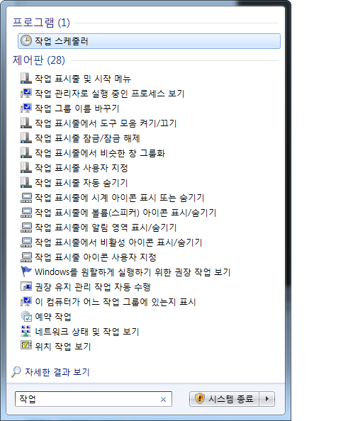
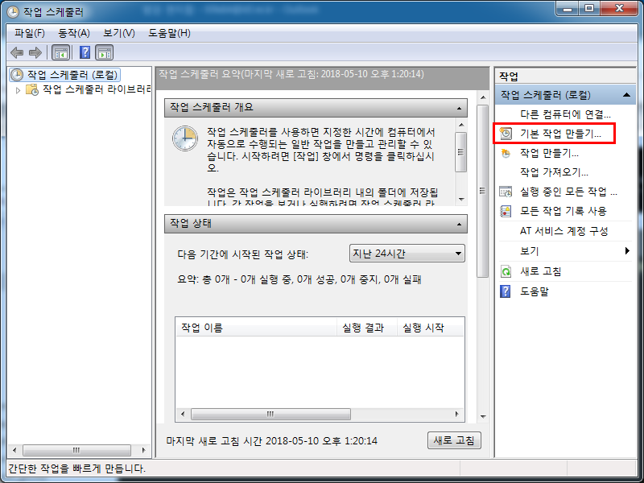
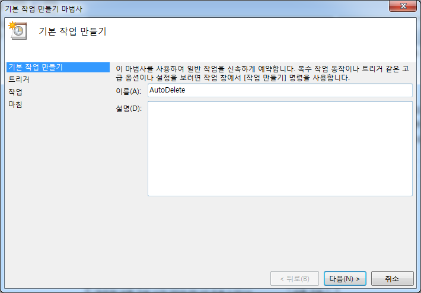
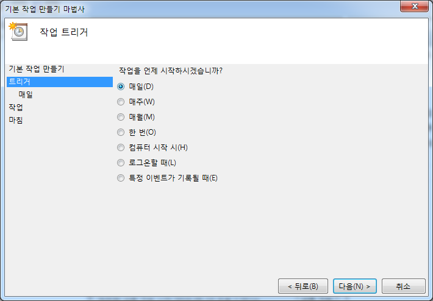
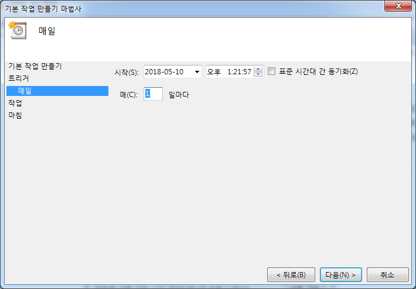
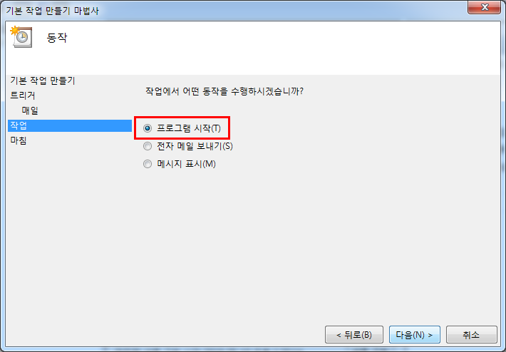
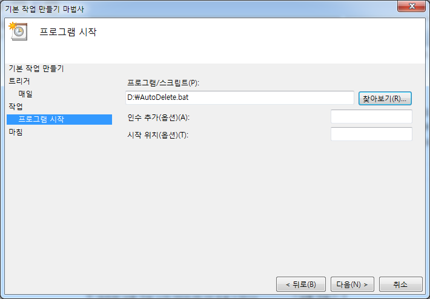
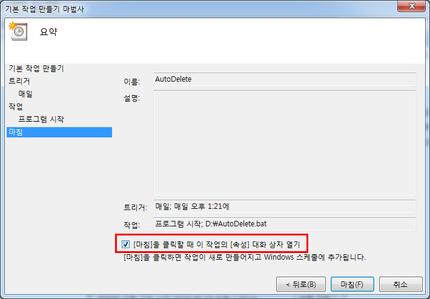
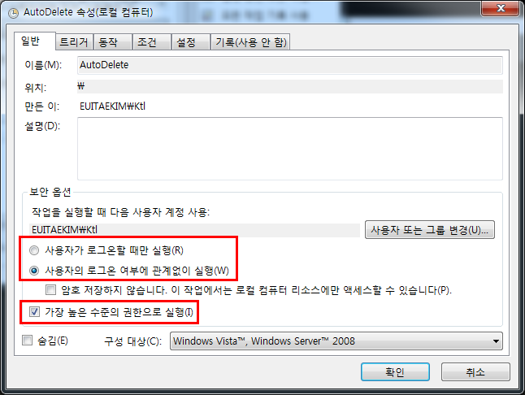

## 배치파일 만들기
원하는 위치에 배치파일을 생성한다. 여기서는 이름을 AutoDelete.bat로 생성하였다. 배치파일의 내용은 아래와 같다.

```
forfiles -p "C:\Users\Ktl\Downloads" -s -m *.* /D -30 /C "cmd /c del /Q @path"
```

### 옵션 설명
* -p "C:\Users\Ktl\Downloads": -p는 검색을 시작할 경로를 지정하기 위해 사용한다. C:\Users\Ktl\Downloads 디렉토리를 검색하겠다는 의미다.
* -s: 하위 디렉토리도 탐색한다.
* -m \*.\*: 검색할 파일 형태를 지정한다.
* /D -30: 30일 이상이 경과한 파일을 검색한다.
* /C: 커맨드 명령어를 실행한다.
* cmd /c: 커맨드 명령어를 실행하기 위해선 cmd /c까지는 기본으로 따라온다. 이후에 오는 명령이 검색된 파일에서 실행될 명령어다. 
* del /Q @path
    + /Q: 옵션은 이 명령어가 자동모드로 실행될 경우(예: 스케쥴러등에 의해) 지울지 말지를 묻지 말라는 의미다. /Q 옵션이 없으면 디렉토리를 지울 것인지를 묻는 질문에 명령어가 멈출 수 있다.
    + @path: @path는 forfiles에서 검색된 각각의 파일명이 풀네임으로 넘어온다. 즉, del /Q @path가 forfile에서 검색된 파일 수만큼 실행된다는 뜻이다.

> 주의: 위 명령어는 디렉토리 자체는 지우지 못한다.

##작업 스케쥴러에 등록
작업 스케쥴러 실행



기본 작업 만들기 선택



이름과 설명 기입



작업 주기 선택



작업 시작 시간 지정



프로그램 시작 선택



배치파일 선택



[마침]을 클릭할 때 이 작의 [속성] 대화 상자 열기 체크 후 마침



스케쥴러가 서버에서 실행된다면 "사용자의 로그온 여부에 관계없이 실행"을 선택하고 "가장 높은 수준의 권한으로 실행"도 체크한다. 이를 체크하지 않을 경우 파일 액세스가 거부될 수 있다.



## 참고 사이트
- [How to Automatically Delete Files in Windows](https://www.online-tech-tips.com/software-reviews/automatically-delete-files/)
- [How to Open Multiple Programs in Windows at Once](https://www.online-tech-tips.com/computer-tips/create-windows-batch-files/)