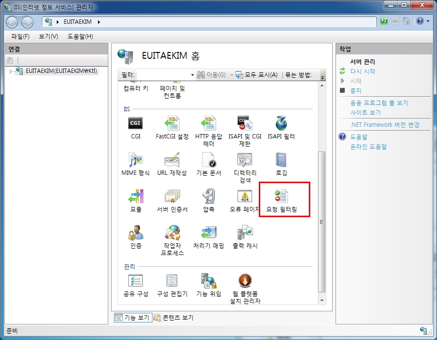
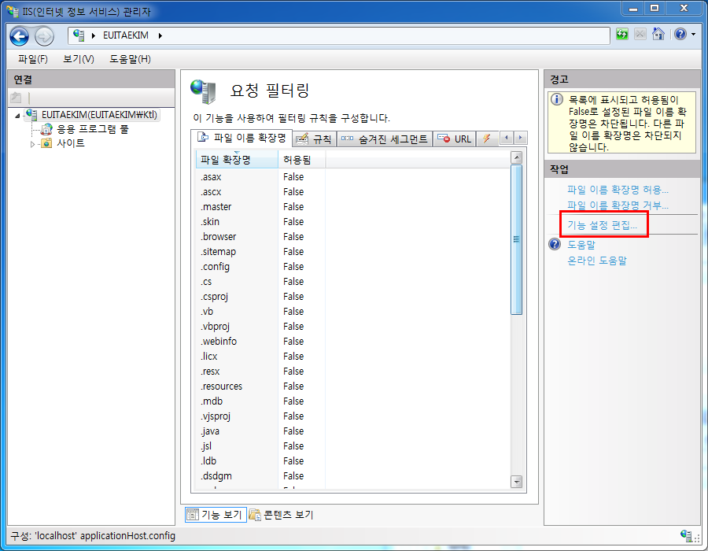
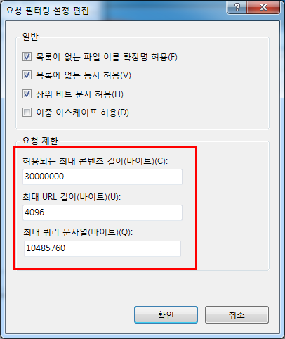
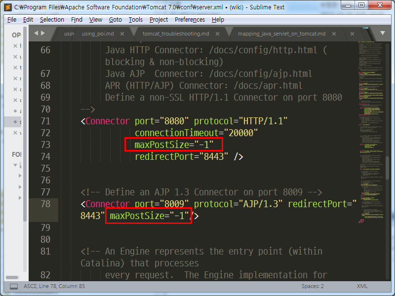

HTTP는 응답(Response)에 대해서는 보통 크기 제한을 두지 않지만 요청(Request)에 대해서는 기본적으로 웹서버에서 크기제한을 둔다. GET메서드의 URL길이가 길어지는 것도 문제가 되지만 POST 메서드를 사용할 때도 파라미터의 크기가 웹서버에서 제한하는 크기보다 크면 응답받는 서버에서 파라미터를 NULL로 받는다. W3C에서 HTTP 요청 크기를 제한하는 것 같진 않으니 필요할 경우 웹서버에서 크기를 늘릴 수 있다.

---

## IIS 7.0
* IIS(인터넷 정보 서비스) 관리자 실행
* 요청 필터링  

* 기능 설정 편집  

* 최대 쿼리 문자열 바이트를 변경  

---

## Tomcat
* C:\Program Files\Apache Software Foundation\Tomcat 7.0\conf\server.xml  
  
톰캣만 사용한다면 "HTTP/1.1" 커넥터에만 maxPostSize="-1"을 추가해도 되지만 IIS와 톰캣을 커넥터로 연결했다면 "AJP/1.3" 커넥터의 maxPostSize를 변경해야 한다. -1은 제한이 없다는 의미다.