## xdebug 설치
- [https://xdebug.org/download.php](https://xdebug.org/download.php)에서 내 PHP버전에 맞게 다운로드
    + VC버전: phpinfo에서 Compiler 확인
    + 비트: phpinfo에서 Architecture 확인
    + Thread Safety: phpinfo에서 Tread Safety 확인
    + PHP버전 확인
- 다운로드 받은 php_xdebug-xxxx.dll파일을 php디렉토리 안의 ext 디렉토리 안에 복사

## PHP 셋팅
- php.ini 파일에 다음 내용 기입
```
[Xdebug]
zend_extension="C:\php-5.6.19\ext\php_xdebug-2.5.5-5.6-vc11-nts.dll"
xdebug.remote_enable=1
xdebug.idekey=PHPSTORM
xdebug.remote_port=9000
xdebug.remote_host=localhost
xdebug.remote_handler=dbgp
;xdebug.profiler_enable=1
;xdebug.profiler_output_dir="<AMP home\tmp>"
```

※ xdebug.profiler는 PHP 코드나 PHP가 느려지는 부분을 디버깅하기에 유용한 툴 같다. 후에 성능향상을 도모할 때 사용해보면 좋을 듯..

## PHPStorm 셋팅(Default)
이 셋팅은 모든 프로젝트에 적용하기 위해 Default Settings를 이용한다. 만약 프로젝트다마다 다른 php버전을 사용한다면 Default Settings를 사용하지 말고 해당 프로젝트를 연 다음에 Settings를 이용한다.

- File > Default Settings > Languages & Frameworks > PHP > CLI Interpreter 옆의 ... 버튼 클릭
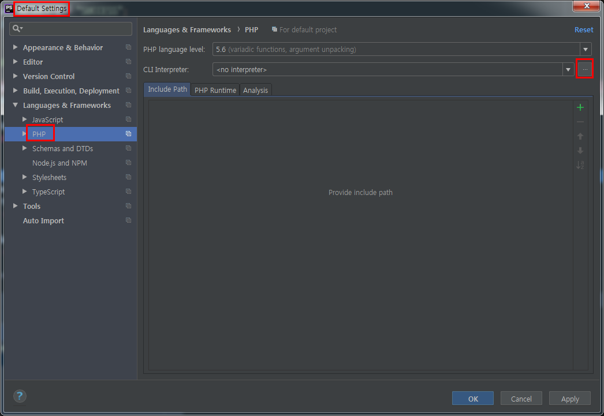

- +버튼을 클릭했을 때 그림과 같이 php.exe 경로가 자동으로 뜨면 해당 경로를 선택하고 아니면 Other Local을 선택하여 php.exe경로를 직접 입력한다.
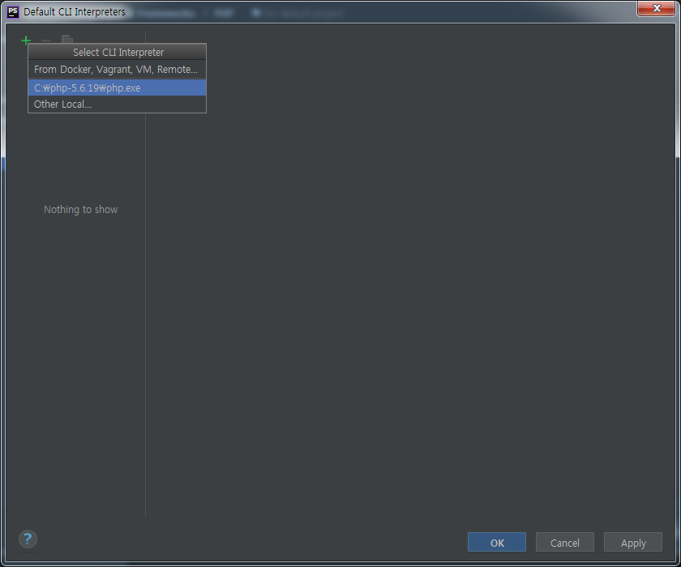

- 버전에 맞는 xdebug를 잘 설치하고 php.ini에도 잘 셋팅했다면 Debugger에 다음과 같이 xdebug의 버전이 보여야 한다. php.ini에 dll경로를 잘 입력했는데 Not Installed라고 뜬다면 버전에 맞지 않는 xdebug를 다운로드 받았을 가능성이 크다.
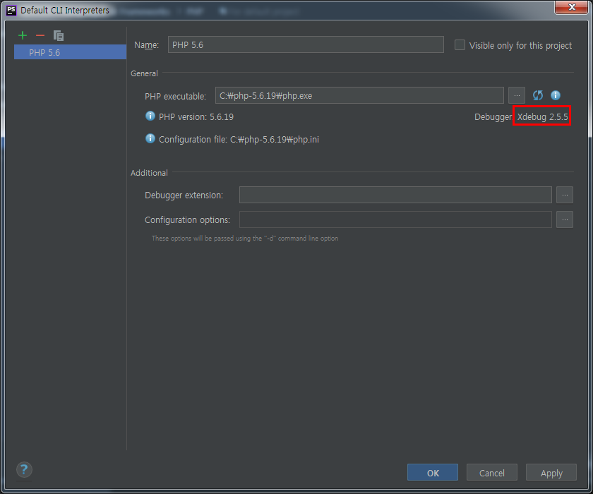

## PHPStorm 셋팅(Project)
프로젝트마다 디버깅하려는 PHP파일 위치가 다를 것이므로 이 셋팅은 프로젝트마다 해야한다.

- File > Settings > Languages & Frameworks > PHP > Servers 에서 + 버튼 클릭
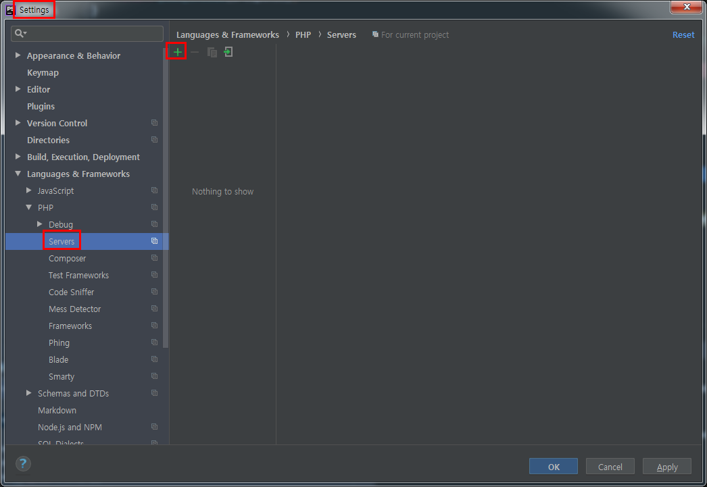

- Name은 임의로, Host는 localhost, Use path mappings 옆 체크박스를 체크하고  Absolute path on the server의 편집 아이콘을 클릭하여 프로젝트에서 php파일이 있는 디렉토리를 지정해준다.
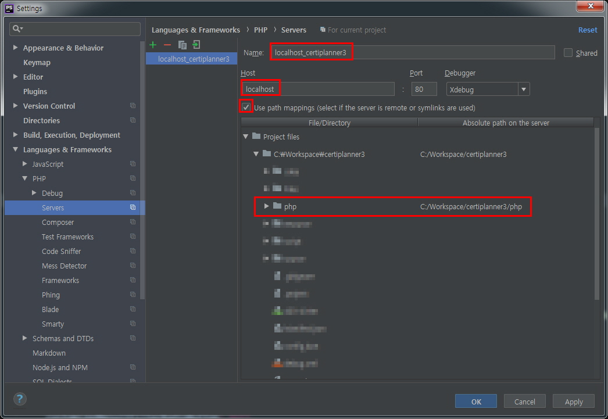

- Run > Edit Configuration 에서 + 버튼을 클릭하여 PHP Remote Debug를 선택한다.
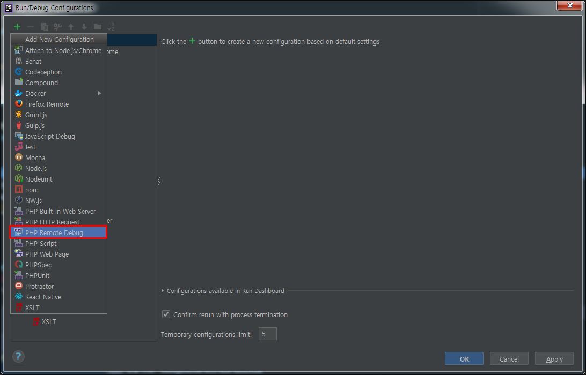

- Filter debug connection by IDE key 옆 체크박스를 체크하고 Server를 위에 만들었던 server로 선택한 뒤 IDE key는 php.ini에서 xdebug.idekey로 지정했던 PHPSTORM을 입력한다.
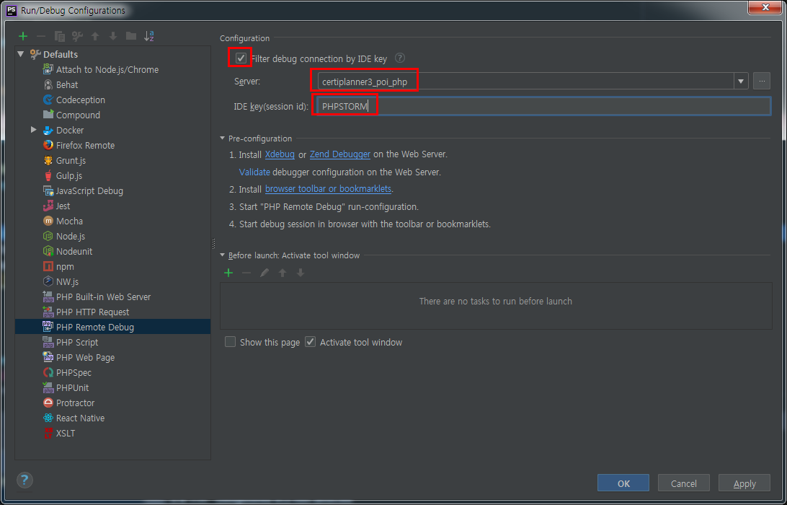

## 크롬 셋팅
크롬이 아닌 브라우저를 이용하고 싶을 경우 [https://confluence.jetbrains.com/display/PhpStorm/Browser+Debugging+Extensions](https://confluence.jetbrains.com/display/PhpStorm/Browser+Debugging+Extensions)를 참고한다.

- 크롬 확장기능인 [Xdebug helper](https://chrome.google.com/webstore/detail/xdebug-helper/eadndfjplgieldjbigjakmdgkmoaaaoc)를 설치한다.
- 설치한 후 Xdebug helper 아이콘을 우클릭하여 옵션을 선택한다.  
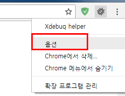
- IDE Key를 PhpStrom으로 선택한 후 Save한다.
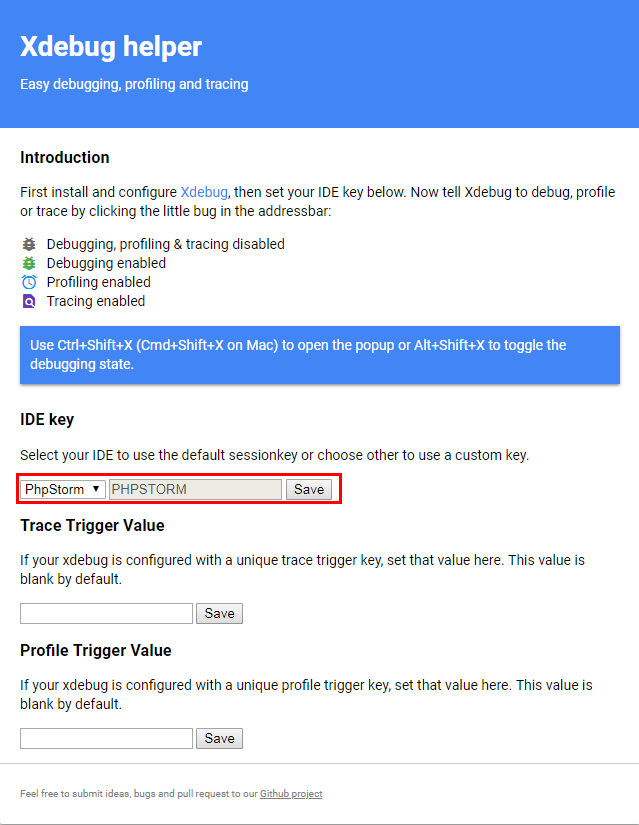

## 디버깅 실행
환경 구성은 모두 끝났다. 디버깅을 위해 PHPStorm에서 Run > Debug에서 위에서 만들었던 Debug환경을 선택한다.

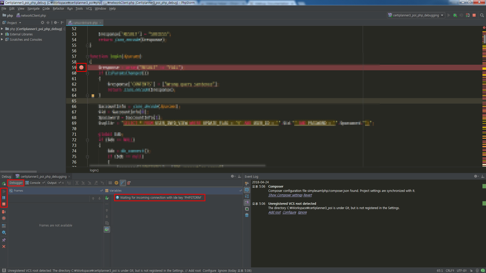

Debug가 실행되면 좌측하단에 빨간정지버튼이 활성화된다. 빨간정지버튼이 활성화됐다는 것은 Debug가 실행중이라는 의미다. Debugger 탭을 클립하면 Waiting for incomig connection with ide key 'PHPSTORM'이라는 메시지를 볼 수 있다. 아직 브라우저에서 PHP로 어떤 호출도 하지 않았기 때문이다. 원하는 위치에 마우스 좌클릭으로 브레이크포인트를 찍은 뒤 브라우저에서 해당코드가 호출되는 동작을 실행한다.

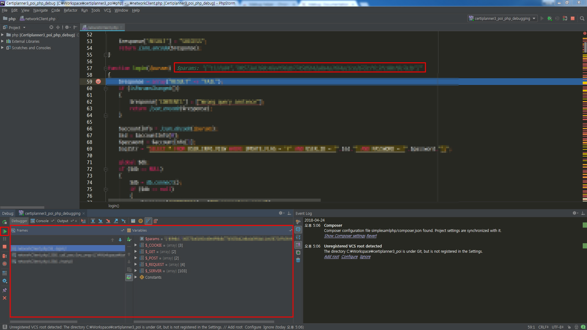

PHP가 호출되면 해당코드에서 브레이크가 걸리며 브라우저도 PHP에서 응답을 받지 못해 대기 상태가 된다. PHPStorm에서는 Waiting for incomig connection with ide key 'PHPSTORM'이라는 메시지가 사라지고 디버깅 요소들을 볼 수 있다.

## 참고 사이트
- [Remote Debugging 원리 및 상세옵션 설정](https://xdebug.org/docs/remote)
- 로컬이 아니라 실제 원격 서버를 디버깅하고자 할 경우 아래 두 사이트를 참고한다
[https://confluence.jetbrains.com/display/PhpStorm/Remote+debugging+in+PhpStorm+via+SSH+tunnel](https://confluence.jetbrains.com/display/PhpStorm/Remote+debugging+in+PhpStorm+via+SSH+tunnel)
[https://confluence.jetbrains.com/display/PhpStorm/Deploying+PHP+applications+with+PhpStorm](https://confluence.jetbrains.com/display/PhpStorm/Deploying+PHP+applications+with+PhpStorm)
원격 서버에 있는 파일을 PHPStorm에 매핑시켜야 하기 때문에 원격 서버에 FTP서버도 구성돼 있어야 한다.
