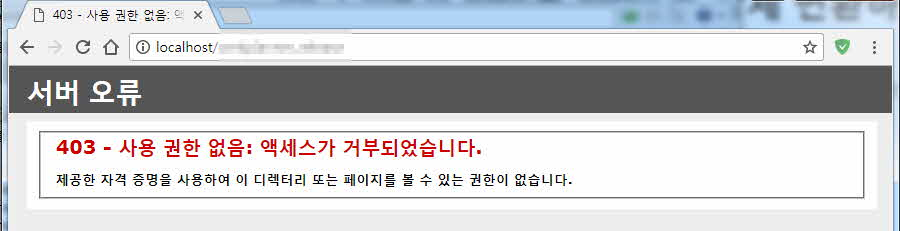

* IIS 관리자 실행
* 웹사이트 전체를 적용하고 싶으면 **Default Web Site를 선택 또는 특정 가상디렉토리**만 적용하고 싶으면 해당 가상디렉토리를 선택한 후 **SSL 설정** (여기서는 Default Web Site로 가정한다.)
* **SSL 필요** 체크


여기까지 진행했다면 http로 접속했을 때 위와 같이 403 에러가 발생한다. 위 에러코드는 실제로는 403.4 에러다. 다음 해줘야 하는 것은 403.4 에러페이지를 만들어서 http로 접속했던 주소를 https로 변경하는 일이다.

* 403.4 에러페이지 작성 (파일이름은 임의로 지정해도 된다. 확장자는 html)

```html
<html>
<head><title>Redirecting...</title></head>
<script language="JavaScript">
function redirectHttpToHttps()
{
    var httpURL= window.location.hostname + window.location.pathname + window.location.search;
    var httpsURL= "https://" + httpURL;
    window.location = httpsURL;
}
redirectHttpToHttps();
</script>
<body>
</body>
</html>
```

* 403.4 에러페이지 지정  
CMD창을 연 후 다음 명령어를 실행한다.

```
C:\Windows\System32\inetsrv\appcmd unlock config –section:system.webServer/httpErros
```

IIS 오류페이지는 기본으로 지정돼있는 상태코드의 경우는 경로만 바꿔주면 되지만 403.4같이 상태코드에 없는 것들은 **C:\Windows\System32\inetsrv\config\applicationHost.config** 파일을 직접 편집해야 한다. 그러나 http오류 페이지는 Default로 Override가 허용되지 않기 때문에 위 명령어로 Override를 가능하게 해준다.  
편집기에서 applicationHost.config 파일을 연다.

```html
<httpErrors errorMode="Custom" defaultPath="C:\inetpub\wwwroot\403-4.htm" lockAttributes="allowAbsolutePathsWhenDelegated,defaultPath">
            <error statusCode="401" prefixLanguageFilePath="%SystemDrive%\inetpub\custerr" path="401.htm" />
            <error statusCode="403" prefixLanguageFilePath="%SystemDrive%\inetpub\custerr" path="403.htm" />
            <error statusCode="404" prefixLanguageFilePath="%SystemDrive%\inetpub\custerr" path="404.htm" />
            <error statusCode="405" prefixLanguageFilePath="%SystemDrive%\inetpub\custerr" path="405.htm" />
            <error statusCode="406" prefixLanguageFilePath="%SystemDrive%\inetpub\custerr" path="406.htm" />
            <error statusCode="412" prefixLanguageFilePath="%SystemDrive%\inetpub\custerr" path="412.htm" />
            <error statusCode="500" prefixLanguageFilePath="%SystemDrive%\inetpub\custerr" path="500.htm" />
            <error statusCode="501" prefixLanguageFilePath="%SystemDrive%\inetpub\custerr" path="501.htm" />
            <error statusCode="502" prefixLanguageFilePath="%SystemDrive%\inetpub\custerr" path="502.htm" />
                
</httpErrors>
```

위의 코드부분을 검색한 뒤 403 코드 부분 아래에 다음 내용을 추가한다. (꼭 403 아래에 추가하지 않아도 상관은 없다.)

```html
<remove statusCode="403" subStatusCode="4" />
<error statusCode="403" subStatusCode="4" path="C:\inetpub\wwwroot\403-4.htm" responseMode="File" />
```

기존에 있던 403.4 코드를 지우고(눈에 보이진 않았지만) 새로 추가하여 path를 지정해주는 내용이다.

```html
<httpErrors errorMode="Custom" defaultPath="C:\inetpub\wwwroot\403-4.htm" lockAttributes="allowAbsolutePathsWhenDelegated,defaultPath">
            <error statusCode="401" prefixLanguageFilePath="%SystemDrive%\inetpub\custerr" path="401.htm" />
            <error statusCode="403" prefixLanguageFilePath="%SystemDrive%\inetpub\custerr" path="403.htm" />
            <remove statusCode="403" subStatusCode="4" />
            <error statusCode="403" subStatusCode="4" path="C:\inetpub\wwwroot\403-4.htm" responseMode="File" />
            <error statusCode="404" prefixLanguageFilePath="%SystemDrive%\inetpub\custerr" path="404.htm" />
            <error statusCode="405" prefixLanguageFilePath="%SystemDrive%\inetpub\custerr" path="405.htm" />
            <error statusCode="406" prefixLanguageFilePath="%SystemDrive%\inetpub\custerr" path="406.htm" />
            <error statusCode="412" prefixLanguageFilePath="%SystemDrive%\inetpub\custerr" path="412.htm" />
            <error statusCode="500" prefixLanguageFilePath="%SystemDrive%\inetpub\custerr" path="500.htm" />
            <error statusCode="501" prefixLanguageFilePath="%SystemDrive%\inetpub\custerr" path="501.htm" />
            <error statusCode="502" prefixLanguageFilePath="%SystemDrive%\inetpub\custerr" path="502.htm" />
                
</httpErrors>
```

최종적으로 수정한 내용이다. IIS를 재실행하면 오류페이지에 403.4 코드의 오류페이지가 지정돼있는 것을 확인할 수 있다.